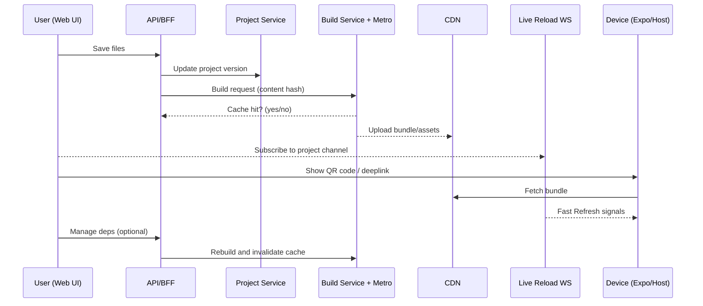
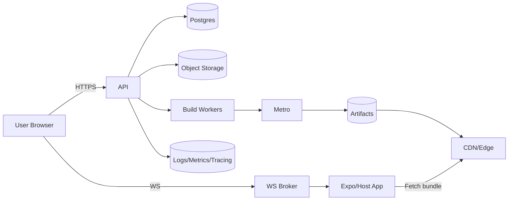

# React Native Playground — Architecture Diagram & Explainer

## Overview

A **React Native Playground** is an environment where developers can write, preview, and test React Native code instantly, without needing a full local setup. Think of it like a CodeSandbox or Expo Snack, but tailored for React Native.

The playground typically supports:

* **Code editing** (in-browser or in-app editor)
* **Instant preview** (on device, emulator, or web preview)
* **Dependency management** (importing npm libraries)
* **Bundling & live reload**
* **Cloud sync & sharing**

This document explains the architecture and shows how different parts of the system interact.

---

## 1. High-Level Architecture

```mermaid
flowchart TD
  subgraph Client_Side [Client Side]
    A[Web UI (Playground Editor)]
    B[Preview Targets]
    B1[Web Preview (React DOM)]
    B2[Android Device/Emulator]
    B3[iOS Device/Simulator]
  end

  subgraph Backend_Services [Backend Services]
    S1[API Gateway / BFF]
    S2[Auth Service]
    S3[Project Service\nCRUD + Metadata]
    S4[Storage\n(S3/GCS/Blob)]
    S5[Build Service\nMetro/Babel/tsc]
    S6[Bundler/Metro\nHermes bytecode]
    S7[Live Reload / WS Broker]
    S8[Sandbox Executor\n(containerized)]
    S9[CDN / Edge Cache]
    S10[Logs & Metrics\n(ELK/CloudWatch/Grafana)]
  end

  subgraph Integrations
    I1[VCS Import\n(GitHub/GitLab)]
    I2[Expo Services / OTA Updates]
    I3[Feature Flags]
  end

  A <--> S1
  S1 --> S2
  S1 --> S3
  S3 --> S4
  A -->|save/open| S3
  A -->|code change| S7
  S7 --> B
  S5 --> S6
  S6 --> S9
  S9 --> B
  S8 -.->|run/evaluate| B2
  S8 -.->|run/evaluate| B3
  A -->|import| I1
  S1 --> I2
  S1 --> I3
```

---

## 2. Developer Workflow (Sequence)



---

## 3. Infra & Deployment View



---

## 4. Explanation of Components

### Client Side

* **Web UI / Editor** — Browser-based code editor (Monaco/VSCode engine).
* **Preview Targets** —

  * Web (via React DOM)
  * iOS / Android emulators
  * Real devices using Expo Go or a custom client.

### Backend Services

* **API Gateway (BFF)** — Orchestrates all client requests.
* **Auth Service** — Handles login/session (JWT, OAuth).
* **Project Service** — Stores user projects, metadata, dependencies.
* **Storage** — Stores uploaded assets.
* **Build Service** — Runs Metro/Babel for bundling.
* **Bundler/Metro** — Produces JavaScript bundles and Hermes bytecode.
* **Live Reload Broker** — Pushes updates via WebSockets.
* **Sandbox Executor** — Runs isolated snippets (Docker, Firecracker, or VM).
* **CDN** — Serves static bundles quickly worldwide.
* **Logs & Metrics** — Observability stack.

### Integrations

* **VCS Import** — Pull projects from GitHub/GitLab.
* **Expo Services** — OTA updates, device client support.
* **Feature Flags** — Gradual rollouts.

---

## 5. Example Developer Flow

1. Developer writes/edit code in browser.
2. Code is synced to backend Project Service.
3. Build Service compiles bundle via Metro.
4. Bundle stored on CDN.
5. Device fetches bundle.
6. Live reload service updates preview instantly.

---

## 6. Benefits

* **Zero-setup**: No local installs needed.
* **Cross-platform**: Test on iOS, Android, Web.
* **Fast feedback**: Live reload and hot updates.
* **Collaboration**: Share links to playgrounds.
* **Scalable**: Uses CDN and caching.

---

✅ This version is fully **GitHub-compatible** — all Mermaid code blocks are wrapped with \`\`\`mermaid fences, node IDs use underscores (no spaces), and edge labels follow the right syntax.
