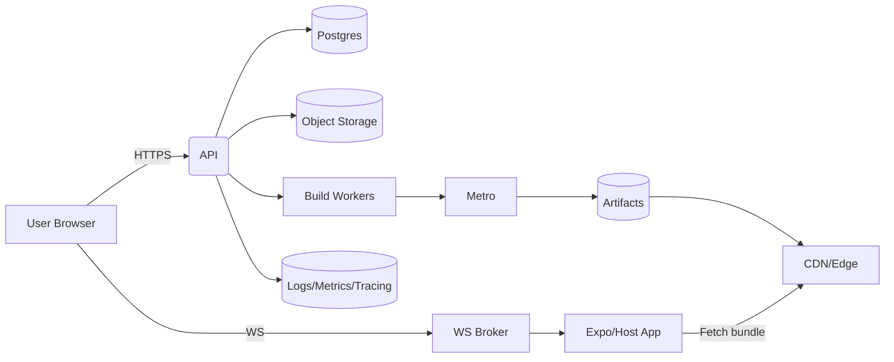

# React Native Playground — Architecture & Implementation Guide

**Author:** <Your Name>
**Date:** August 25, 2025
**Audience:** Engineering, Product, DevOps, Security

---

## 1) Purpose & Goals

A React Native (RN) Playground lets users write RN code snippets or mini-projects in the browser, run them instantly on a device simulator (web/Android/iOS), and share links. Think “Expo Snack” or “RN Sandbox” tailored to our org.

**Primary goals**

* Instant feedback: edit → run in seconds with live reload/Fast Refresh.
* Safe execution: isolate untrusted code from production systems and other users.
* Real RN environment: supports native APIs via Expo Go or custom host app.
* Shareable artifacts: permalinked projects, QR codes to open on real devices.
* Extensible: custom libraries, feature flags, and integrations.

**Out of scope (initial):** custom native module compilation per user on-demand (can be Phase 2 via cloud builds).

---

## 2) High‑Level Architecture (Cloud + Client)


flowchart TD
  subgraph Client Side
    A[Web UI (Playground Editor)]
    B[Preview Targets]
    B1[Web Preview (React DOM)]
    B2[Android Device/Emulator]
    B3[iOS Device/Simulator]
  end

  subgraph Backend Services
    S1[API Gateway / BFF]
    S2[Auth Service]
    S3[Project Service\nCRUD + Metadata]
    S4[Storage\n(S3/GCS/Blob)]
    S5[Build Service\nMetro/Babel/tsc]
    S6[Bundler/Metro\nHermes bytecode]
    S7[Live Reload / WS Broker]
    S8[Sandbox Executor\n(containerized)]
    S9[CDN / Edge Cache]
    S10[Logs & Metrics\n(ELK/CloudWatch/Grafana)]
  end

  subgraph Integrations
    I1[VCS Import\n(GitHub/GitLab)]
    I2[Expo Services / OTA Updates]
    I3[Feature Flags]
  end

  A <--> S1
  S1 --> S2
  S1 --> S3
  S3 --> S4
  A -->|save/open| S3
  A -->|code change| S7
  S7 --> B
  S5 --> S6
  S6 --> S9
  S9 --> B
  S8 -. run/evaluate .-> B2
  S8 -. run/evaluate .-> B3
  A -->|import| I1
  S1 --> I2
  S1 --> I3
```

**Key idea:** The Web UI edits code and talks to an API/BFF. Code is built by the Build Service (Metro) into RN bundles (and optionally Hermes bytecode). Bundles are served from CDN with Live Reload over WebSockets. For device testing, we use Expo Go or a custom Host App; for untrusted evaluation, we optionally run code inside a locked-down Sandbox Executor.

---

## 3) Core Components

### 3.1 Web UI (Playground Editor)

* Monaco-based editor (JS/TS/JSX), file tree, deps list, device selector.
* "Run" triggers (a) fast client-side refresh for web preview or (b) rebuild & OTA push for native targets.
* QR code generator to open the project on a physical device (Expo Go or host app).

### 3.2 API Gateway / BFF

* Single endpoint for the Web UI; aggregates services.
* Handles auth tokens, rate limiting, CORS, request fan-out.

### 3.3 Auth

* OAuth/OIDC for SSO; anonymous sessions for quick try.
* Project-level permissions (owner, editor, viewer).

### 3.4 Project Service

* CRUD for projects/snippets, versioning, forks, stars.
* Metadata: RN SDK version, dependencies, target platforms, feature flags.

### 3.5 Storage

* Source files and build artifacts. Immutable build outputs for cache hits.

### 3.6 Build Service & Metro Bundler

* Compile TS/JS → JS (Babel/tsc), package assets, generate source maps.
* Output targets: web (webpack), native JS bundle, optional Hermes bytecode.
* Cache by content hash for instant rebuilds on small edits.

### 3.7 Live Reload / WebSocket Broker

* Push Fast Refresh messages to all connected previews/devices.
* Multiplexed channels per project/session.

### 3.8 Sandbox Executor (optional but recommended)

* Runs example code in a container/VM with strict egress policy.
* Useful for running Node-only tooling (typecheck, tests) or scripts.
* Not for running native UI; that runs on device/simulator.

### 3.9 Preview Targets

* **Web (React DOM)**: immediate preview for pure JS/React code.
* **Android/iOS**: via Expo Go or a thin Host App that downloads bundles from CDN and connects to Live Reload.

### 3.10 CDN/Edge Cache

* Serve bundles/assets globally to reduce cold-start time.

### 3.11 Observability

* Centralized logs, metrics, traces; per-session log collection streamed back to the editor.

---

## 4) Two Execution Models (choose per project)

### A) Device‑First (Expo/Host App)

* Editor produces RN bundle; device loads the bundle over HTTP(s).
* Fast Refresh via WS to trigger reconciles without full rebuilds.
* Pros: true native behavior; simple mental model.
* Cons: cannot dynamically add arbitrary native modules at runtime (needs rebuild of host app).

### B) Cloud‑Sandbox Assisted

* Editor also sends code to a sandbox that can run tooling or headless checks.
* Useful for linting, tests, static checks, TypeScript, dependency resolution.
* Pros: reproducibility, isolation, security.
* Cons: cost and orchestration complexity.

> Production systems typically combine both: device-first rendering plus a sandbox for heavy tasks.

---

## 5) Detailed Flows

### 5.1 Edit → Run (Native device)

```mermaid
sequenceDiagram
  participant U as User (Web UI)
  participant BFF as API/BFF
  participant PR as Project Svc
  participant BL as Build Svc + Metro
  participant CDN as CDN
  participant WS as Live Reload WS
  participant DV as Device (Expo/Host)

  U->>BFF: Save files
  BFF->>PR: Update project version
  BFF->>BL: Build request (content hash)
  BL-->>BFF: Cache hit? (yes/no)
  BL-->>CDN: Upload bundle/assets
  U-->>WS: Subscribe to project channel
  U->>DV: Show QR code / deeplink to project
  DV->>CDN: Fetch bundle
  WS-->>DV: Fast Refresh signals on next edits
  U->>BFF: Install/remove deps (optional)
  BFF->>BL: Rebuild; invalidates CDN; propagate
```

### 5.2 Dependency Add/Remove

* Editor updates `package.json`.
* Build Service resolves semver via a curated registry mirror (to prevent supply-chain attacks), locks versions, rebuilds.
* Host App only supports a whitelisted set of native modules; others require a full host rebuild (Phase 2: on-demand EAS build).

### 5.3 Sharing & Collaboration

* Generate permalink; toggle visibility (private/unlisted/public).
* Live cursors & presence via WebRTC or WS.
* Fork & diff views; comments attached to lines.

---

## 6) Data Model (sketch)

* **Project**: id, ownerId, visibility, rnSdkVersion, createdAt, updatedAt.
* **File**: path, contentHash, size, text/binary, projectId, versionId.
* **Build**: id, projectId, inputHash, outputs\[], status, logsRef, duration.
* **Session**: id, projectId, userId, wsChannel, deviceTargets\[].

---

## 7) Security & Isolation

* Strict CORS, CSRF tokens for mutations.
* JWT access tokens; short-lived; refresh with PKCE.
* Sandbox egress allowlist; no host network by default.
* Registry mirror + dependency allowlist/denylist; provenance checks (Sigstore).
* Resource limits per session: CPU/mem/time, file quota, rate limits.
* Log redaction; secret scanning of uploaded files.

---

## 8) Scalability & Performance

* Content-addressed storage and build caching (restore on cache hit).
* Horizontal scaling for WS broker with sticky sessions (Redis or NATS).
* Pre-warm common SDK versions; shard by RN SDK & platform.
* CDN edge caching for bundles; immutable URLs.

---

## 9) Tech Choices (reference stack)

* **Editor:** React + Vite, Monaco, Zustand/Redux, TanStack Query.
* **RN runtime:** Expo SDK/Go for fast iteration; custom Host App for advanced modules.
* **Builds:** Metro + Babel; TypeScript; optional Hermes compilation.
* **Backend:** Node/TypeScript (NestJS) or Go for BFF & services.
* **Storage:** S3/GCS; **DB:** Postgres; **Cache:** Redis.
* **WS:** Socket.IO or native WS behind a broker.
* **CI/CD:** GitHub Actions; infra as code (Terraform). Canary via feature flags.
* **Observability:** OpenTelemetry, Loki/ELK, Prometheus + Grafana, Sentry.

---

## 10) API Sketch (BFF)

```http
POST /v1/projects {name, template, visibility}
GET  /v1/projects/:id
PUT  /v1/projects/:id/files {changes[]}
POST /v1/projects/:id/build {targets:[web,android,ios]}
GET  /v1/projects/:id/builds/:buildId
WS   /v1/ws?projectId=...  // Fast Refresh channel
POST /v1/projects/:id/deps {add:[...], remove:[...]}
```

---

## 11) Observability & DX

* Per-build logs streamed to editor (tail -f feel).
* Client performance beacons (TTFB, FCP, Fast Refresh latency).
* Error boundaries in the host app to show redboxes nicely with source maps.

---

## 12) Non‑Functional Requirements

* **Latency:** first preview ≤ 5–10s on cold start, subsequent refresh ≤ 1s.
* **Reliability:** 99.9% WS uptime; autoscale for spikes (workshops).
* **Security:** SOC2-friendly logging; periodic pen tests.
* **Cost:** keep steady-state by caching & edge delivery; tear down idle sandboxes.

---

## 13) Risks & Mitigations

* **Untrusted code abuse** → Isolation, rate limits, registry mirror.
* **Native deps sprawl** → Whitelist, phase-2 on-demand builds.
* **Long build times** → Pre-warmed caches, incremental builds, content hashing.
* **Mobile device fragmentation** → Require minimum SDK versions; test matrix.

---

## 14) Project Plan (you can copy/paste into Jira)

**Milestone 1: Prototype (1–2 weeks)**

* Web editor with file tree, save/load projects.
* WS broker + Fast Refresh to a host app (Android first).
* Basic Build Service (Metro) + CDN upload.

**Milestone 2: Share & Collaborate (2–3 weeks)**

* Permalinks, QR codes, permissions.
* Logs streaming, metrics.

**Milestone 3: Sandbox & Deps (2–3 weeks)**

* Registry mirror, dependency install workflow.
* Cloud sandbox for lint/tsc/tests.

---

## 15) Appendix A — Alternative Topologies

### Minimal (no backend) for demos

* All code in URL or Gist; device loads from gist/raw; limited features.

### Heavyweight (per-user builds)

* EAS-style builders for arbitrary native modules; queued workers; cache per module version.

---

## 16) Printable One‑Pager (for execs)

* **What:** A safe, fast RN coding playground with real device previews.
* **Why:** Lowers onboarding friction, accelerates prototyping, enables workshops.
* **How:** Editor → Build Service (Metro) → CDN → Host App with Fast Refresh; optional Sandbox for tooling.
* **Security:** Isolation, allowlisted deps, audit logs.
* **Success:** First preview ≤10s, refresh ≤1s, 1k concurrent sessions.

---

## 17) High‑Level Infra Diagram (alt view)



---

### Hand‑off Checklist for Tomorrow

* [ ] Architecture diagrams included (Sections 2 & 17).
* [ ] Flow diagram included (Section 5.1).
* [ ] Clear component breakdown & responsibilities.
* [ ] Security, scaling, NFRs, risks present.
* [ ] API sketch for engineers to start.
* [ ] One‑pager for non‑technical review.

> Replace placeholders (e.g., tool choices) with your org’s standards before publishing.
