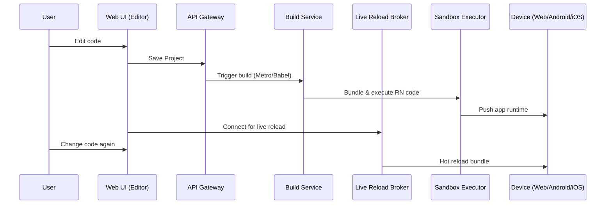

# React Native Playground – Architecture & Documentation

This document explains the high-level architecture of a **React Native Playground** (similar to Expo Snack or CodeSandbox for RN). It includes diagrams (in Mermaid syntax, GitHub-compatible), component breakdowns, flows, and key considerations.

---

## 1. High-Level Architecture

```mermaid
flowchart TD
subgraph "Client Side"
  A[Web UI (Playground Editor)]
  B[Preview Targets]
  B1[Web Preview (React DOM)]
  B2[Android Device/Emulator]
  B3[iOS Device/Simulator]
end

subgraph "Backend Services"
  S1[API Gateway / BFF]
  S2[Auth Service]
  S3[Project Service - CRUD + Metadata]
  S4[Storage (S3/GCS/Blob)]
  S5[Build Service (Metro/Babel/tsc)]
  S6[Bundler/Metro/Hermes bytecode]
  S7[Live Reload / WS Broker]
  S8[Sandbox Executor (containerized)]
  S9[CDN / Edge Cache]
  S10[Logs & Metrics (ELK/CloudWatch/Grafana)]
end

subgraph "Integrations"
  I1[VCS Import (GitHub/GitLab)]
  I2[Expo Services / OTA Updates]
  I3[Feature Flags]
end

A <--> S1
B --> S2
S1 --> S3
S3 --> S4
A --> I1

```

---

## 2. Flow – Editing & Running Code



---

## 3. Components Breakdown

### **Frontend (Client Side)**

* **Web Playground Editor**: Monaco/CodeMirror editor for JSX/JS.
* **Preview Panel**: iFrame/web view or device emulator.
* **Device Bridges**: iOS Simulator, Android Emulator, Web DOM.

### **Backend Services**

* **API Gateway**: Entry point for requests.
* **Auth Service**: OAuth (GitHub/Google) or JWT.
* **Project Service**: CRUD for code/projects.
* **Storage**: S3, GCS, or blob storage.
* **Build Service**: Runs Metro, Babel, TypeScript.
* **Bundler**: Produces RN bytecode (Hermes).
* **WS Broker**: Live reload / hot refresh.
* **Sandbox Executor**: Runs code in secure containers.
* **CDN**: Fast delivery of built bundles.
* **Monitoring**: Logs & metrics.

### **Integrations**

* **VCS Import**: Import repos from GitHub/GitLab.
* **Expo Services**: OTA updates.
* **Feature Flags**: Rollouts, experiments.

---

## 4. Security Considerations

* Sandbox execution with container isolation.
* Rate limiting on API Gateway.
* Authentication & RBAC.
* Monitoring + alerting.

---

## 5. Scaling Concerns

* CDN for bundles.
* Horizontal scaling of Sandbox Executors.
* Queue-based builds.
* Autoscaling for peak traffic.

---

## 6. Example API Contract (Simplified)

```http
POST /projects
{
  "name": "My RN Project",
  "files": { "App.js": "export default App;" }
}

GET /projects/{id}
GET /projects/{id}/build
```

---

## 7. Non-Functional Requirements

* Latency < 200ms for edits.
* 99.9% uptime.
* Device fidelity (emulator = real device).

---

## 8. Risks & Mitigations

* **Infinite loops in code** → Timeout in Sandbox.
* **Abuse (crypto mining)** → Resource quotas.
* **Slow builds** → Incremental caching.

---

## 9. One-Liner for Stakeholders

> The React Native Playground provides an **instant coding sandbox** for RN apps with live preview on web and devices, powered by containerized builds, hot reload, and scalable cloud services.

---
